# CHAPTER IV: IMPLEMENTATION AND RESULTS
## (Mobile and Web Development based FYPs)

**Project Title:** Design and Implementation of a Web-Based Research Management System for Jamhuriya University  
**Specialization:** Computer Applications (Mobile and Web based FYP)  
**Faculty:** Faculty of Computer and Information Technology  
**University:** Jamhuriya University of Science and Technology (JUST)

---

## 4.1 Introduction

This chapter presents the implementation, testing, and evaluation of the Jamhuriya Research Management System (JUST RMS). It connects the methodology described in Chapter III to a working web application and reports how the system was built, verified, and assessed against the research objectives.

The system is a **web-based** Final Year Project (responsive in the browser). A separate native mobile application was **out of scope**; mobile access is supported through a responsive React user interface that works on phones and tablets. The implementation covers:

1. Web application screens (researcher, coordinator, finance, director, leadership).  
2. Backend REST API and MongoDB data layer.  
3. Functional, integration, and security testing.  
4. Results that show the system meets the defined requirements for managing the research lifecycle from proposal to closure, including thesis supervision.

All screenshots in this chapter were captured from the running local application (React client on port 5173, Express API on port 5000) using the seeded demo institutional accounts.

---

## 4.2 Snapshots of the System

This section shows the main web interfaces as implemented and how they were tested. Figures are embedded below; in the printed thesis, place each figure centered with the caption underneath (Times New Roman, as per JUST FYP guideline).

### Figure 4.1 — Login page and demo institutional accounts

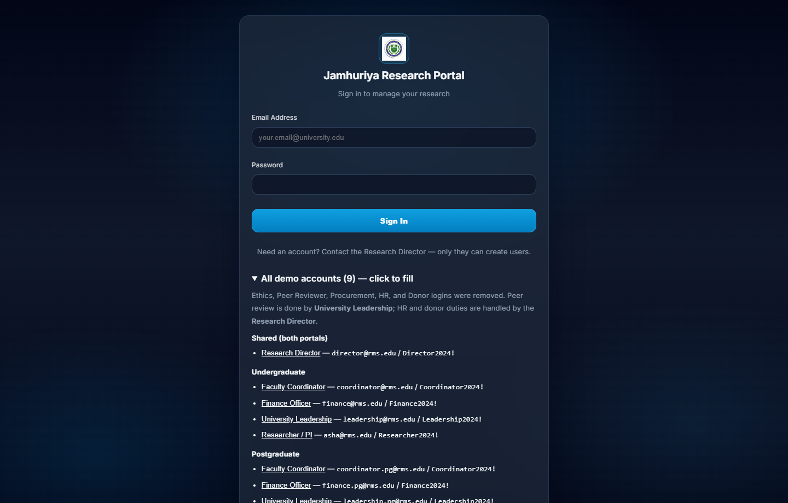

**Figure 4.1:** Login page of the Jamhuriya Research Portal. Users sign in with university email and password. Only the Research Director creates accounts. Demo accounts illustrate the active roles after removal of HR Officer and Donor Agency logins: Director (shared), plus Undergraduate and Postgraduate Coordinator, Finance, Leadership, and Researcher/PI accounts.

### Figure 4.2 — Program portal selection (Undergraduate / Postgraduate)

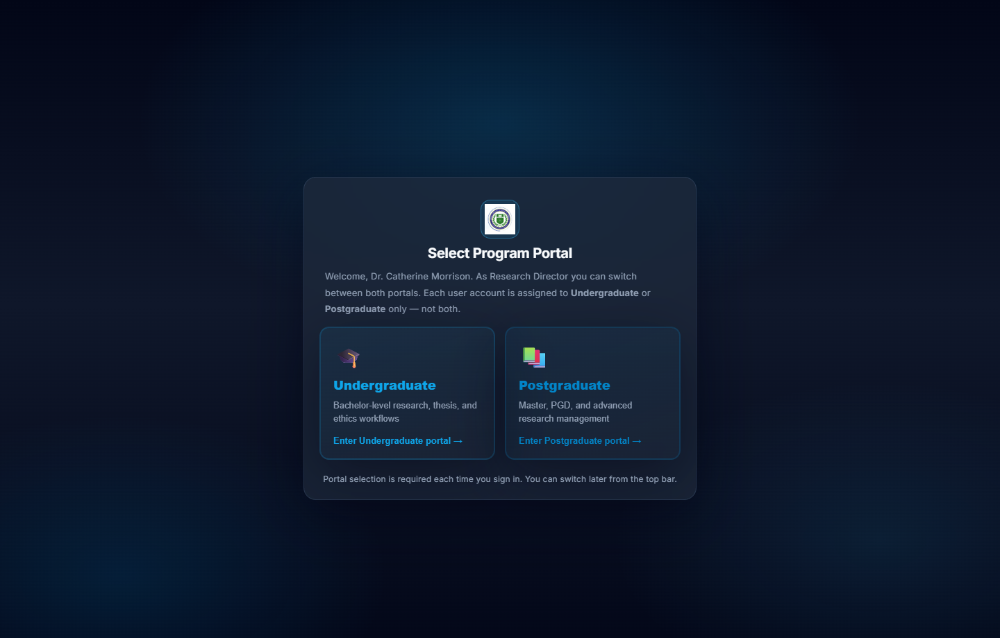

**Figure 4.2:** After login, the Research Director must select the **Undergraduate** or **Postgraduate** portal. Other accounts are fixed to one portal. Portal choice is stored in session storage and sent to the API as `X-Program-Tier`, so UG and PG data remain isolated.

### Figure 4.3 — Research Director dashboard and analytics

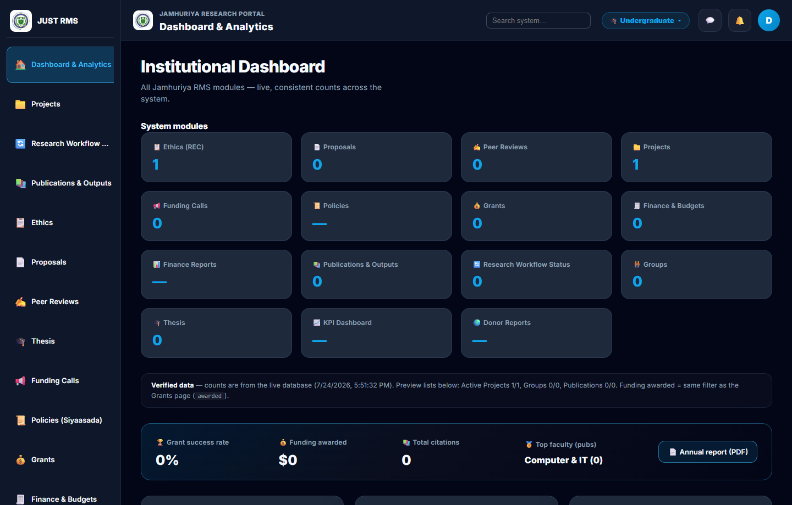

**Figure 4.3:** Institutional Dashboard for the Research Director (Undergraduate portal). Live counts are shown for Ethics, Projects, Proposals, Grants, Thesis, and related modules, with KPI summary cards and charts for project status, funding, and research output.

### Figure 4.4 — Proposals review queue

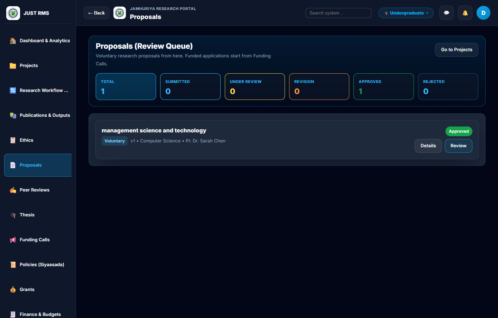

**Figure 4.4:** Proposals (Review Queue). Staff see voluntary research proposals with status filters (Total, Submitted, Under review, Revision, Approved, Rejected). Funded applications are started from Funding Calls, not from this voluntary queue.

### Figure 4.5 — Multi-stage proposal and ethics review

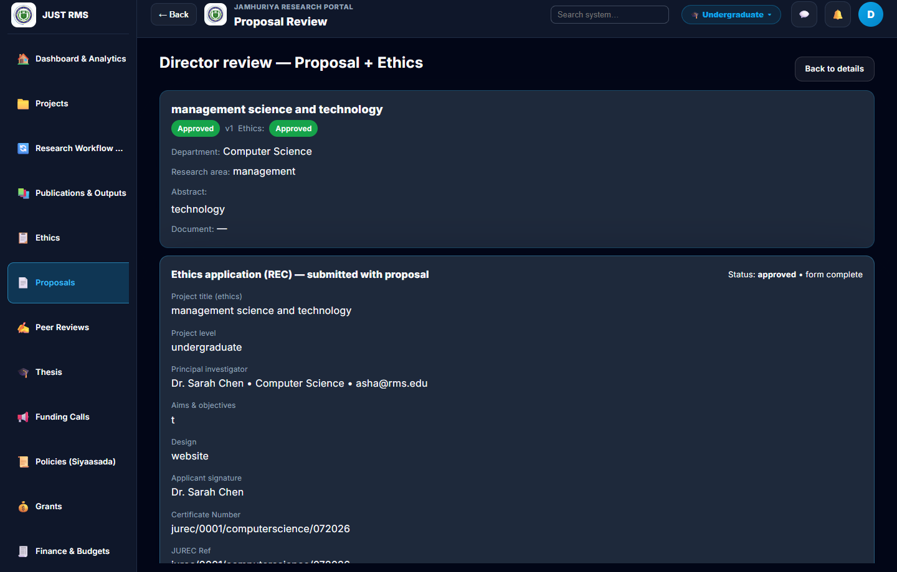

**Figure 4.5:** Director review screen combining **proposal** and **ethics (REC)** in one pipeline. Approved proposals show linked ethics status, JUREC certificate reference, certificate download, and peer-reviewer assignment (University Leadership).

### Figure 4.6 — Ethics (JUREC) clearance

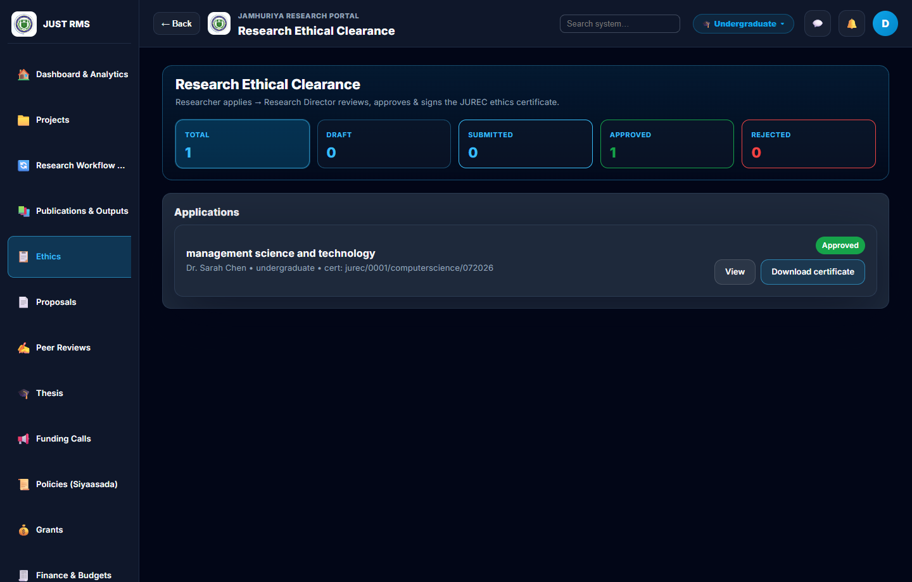

**Figure 4.6:** Research Ethical Clearance module. Researchers apply; the Research Director reviews, approves, and signs the JUREC ethics certificate. Approved applications expose **View** and **Download certificate**.

### Figure 4.7 — Projects list and workflow

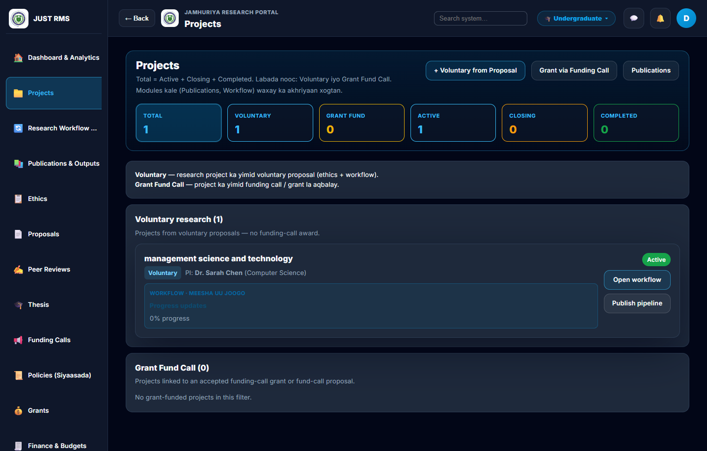

**Figure 4.7:** Projects module. Voluntary projects are created when a proposal is approved; grant-funded projects come from Funding Calls. Each project card shows PI, status, progress, and links to open the workflow or publish pipeline.

### Figure 4.8 — Funding calls

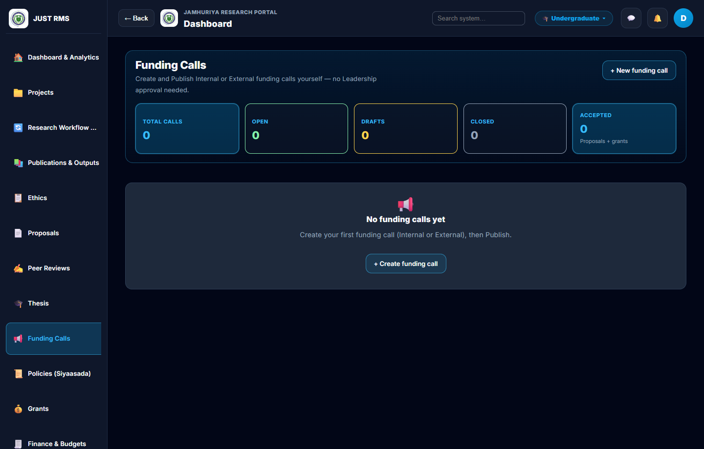

**Figure 4.8:** Funding Calls. The Research Director creates and publishes Internal or External calls (no Leadership approval required). Open calls allow researchers to apply; applications appear under Grants.

### Figure 4.9 — Finance and budgets

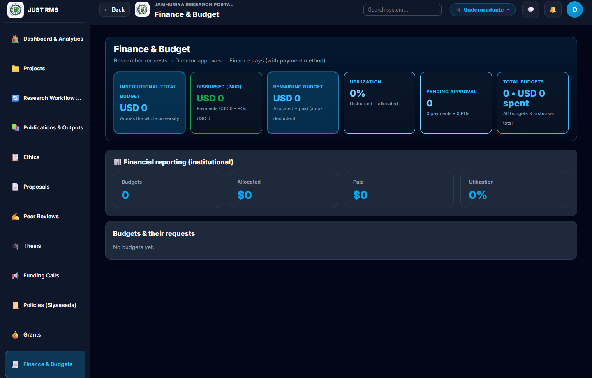

**Figure 4.9:** Finance & Budget. Institutional totals show allocated, disbursed, remaining, and pending approval amounts. Workflow: researcher requests → Director approves → Finance pays (with payment method). Purchase-order review is handled in this finance area.

### Figure 4.10 — Thesis groups

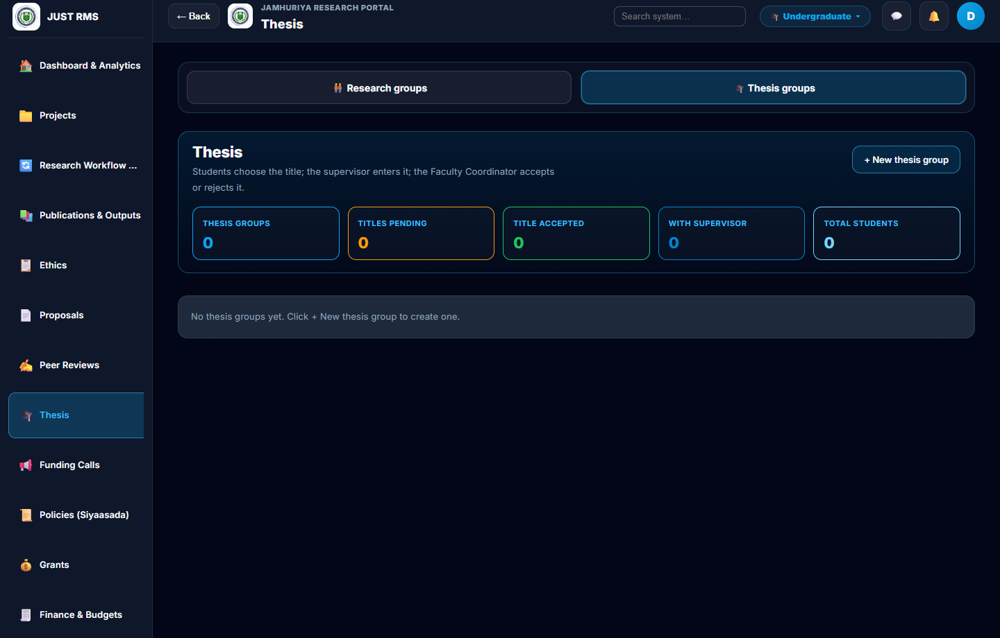

**Figure 4.10:** Thesis module (Undergraduate). Students choose a title; the supervisor enters it; the Faculty Coordinator accepts or rejects. Thesis groups support chapters, meetings, and **final PDF/Word document upload** by the supervisor for staff download.

### Figure 4.11 — Publications and outputs

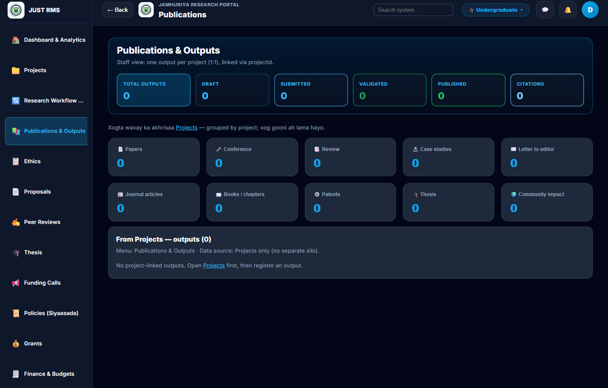

**Figure 4.11:** Publications & Outputs. Staff see one output per project (linked by `projectId`), with type categories (papers, conference, books, thesis, patents, etc.). The institutional repository module stores downloadable research files for the same portal.

---

### 4.2.1 Web Application Implementation and Testing

The web client was implemented with **React.js** (Vite). Role-based menus and protected routes ensure each user sees only authorized modules. Active institutional roles in the implemented system are:

| Role | Main web modules |
|------|------------------|
| Research Director | Users, departments, proposals, ethics, funding calls, projects, budgets, donor reports, analytics, KPI |
| Faculty Coordinator | Proposals/faculty review, thesis title accept/reject, groups, projects |
| Finance Officer | Budgets, payments, purchase-order review, grant funding approval, finance reports |
| Researcher / PI (Supervisor) | Proposals, projects, grants, publications, repository, thesis supervision, meetings, final thesis upload |
| University Leadership | Peer review scoring, policies, grants visibility, KPI |

Undergraduate (UG) and Postgraduate (PG) data are isolated by program tier. The Research Director selects the portal after login (Figure 4.2); other accounts are fixed to one portal.

#### 4.2.1.1 Functional Testing

Functional testing used a **black-box** approach: testers entered inputs through the UI and checked expected outputs and database side-effects, without relying on internal code paths for pass/fail decisions.

**Table 4.1 Sample functional test cases (web application)**

| Test ID | Module | Input / Action | Expected Result | Actual Result | Status |
|---------|--------|----------------|-----------------|---------------|--------|
| FT-01 | Auth | Valid director credentials | Login success; portal selection shown | As expected (Fig. 4.1–4.2) | Pass |
| FT-02 | Auth | Invalid password | Error message; no session | As expected | Pass |
| FT-03 | Proposals | Researcher submits proposal with PDF | Status → submitted; visible to staff | As expected | Pass |
| FT-04 | Review | Leadership submits peer score 1–5 | Peer stage marked; director sees result (no re-entry) | As expected | Pass |
| FT-05 | Ethics | Director approves ethics application | Status approved; certificate downloadable | As expected (Fig. 4.5–4.6) | Pass |
| FT-06 | Approval | Director approves proposal | Project auto-created and linked | As expected (Fig. 4.7) | Pass |
| FT-07 | Grants | Researcher applies via open funding call | Grant draft/application stored with call link | As expected | Pass |
| FT-08 | Finance | Finance authorizes grant budget | Budget available; status updated | As expected | Pass |
| FT-09 | PO | Researcher creates PO → Finance review → Director → Pay | Status pipeline advances; funds deducted | As expected | Pass |
| FT-10 | Thesis | Supervisor proposes title | Coordinator sees Accept/Reject | As expected | Pass |
| FT-11 | Thesis | Supervisor uploads final PDF/Word | File stored; staff can view/download; optional completed status | As expected | Pass |
| FT-12 | Tier | UG user cannot see PG-only records | 403 / empty list for other portal | As expected | Pass |

CRUD operations (create, read, update, delete where allowed), login, validation of required fields, and document upload (PDF/DOC/DOCX) were covered in the test suite and manual role walkthroughs.

#### 4.2.1.2 UI/UX Evaluation

Design principles applied:

- **Consistency:** Shared layout (sidebar, top bar), cards, buttons, and status badges across modules (visible in Figures 4.3–4.11).  
- **Responsiveness:** Layout adapts from desktop to smaller screens; forms wrap without horizontal overflow.  
- **Clarity:** Page headers with filterable statistics; muted helper text; green/amber/red semantic colors for approved/pending/rejected.  
- **Navigation:** Role-filtered sidebar reduces clutter; deep-links from notifications open the related record.

Improvements made after testing feedback included: clearer ethics certificate download (program-tier header), thesis title Accept/Reject on the card, and a unified navy–sky theme across all dashboards.

### 4.2.2 Mobile Application Implementation and Testing

A **native** Android/iOS application was **not developed** in this FYP (declared out of scope). Mobile use is through the **responsive web UI**.

| Criterion | Approach in this FYP |
|-----------|----------------------|
| Mobile app features | Responsive web: login, proposals, notifications, thesis upload on mobile browsers |
| Unit / integration (mobile) | Not applicable for native apps; web client covered under §4.2.1 and §4.3 |
| Device compatibility | Manual checks on Chrome (desktop) and mobile browser viewport; layout remains usable |

*(If the panel asks for “mobile,” explain: Progressive Web / responsive delivery; native app listed under future work in Chapter V.)*

---

## 4.3 Backend and API Development & Testing

### 4.3.1 Backend

The backend was implemented with **Node.js** and **Express.js**. **MongoDB** (via Mongoose) stores institutional research data. The API is organized by domain controllers and routes (proposals, projects, grants, budgets, ethics, thesis groups, analytics, users, notifications, etc.).

**Figure 4.12 — Three-tier architecture (conceptual)**

```
┌─────────────────────────┐
│  React Web Client       │  Vite / React Router / JWT in storage
│  (Browser / responsive) │  Program tier in sessionStorage
└───────────┬─────────────┘
            │ HTTPS / REST  (+ Authorization, X-Program-Tier)
┌───────────▼─────────────┐
│  Express REST API       │  RBAC middleware, Multer uploads
│  Node.js + Mongoose     │  Controllers & domain routes
└───────────┬─────────────┘
            │
┌───────────▼─────────────┐
│  MongoDB                │  Users, proposals, ethics, projects,
│  (local / Atlas)        │  grants, budgets, thesis groups, …
└─────────────────────────┘
```

**Figure 4.12:** Three-tier architecture — React browser client → Express REST API → MongoDB.

Main backend responsibilities:

- Authenticate users (JWT) and enforce **role-based access control (RBAC)**.  
- Scope all queries by **program tier** (UG / PG).  
- Persist uploads under `/uploads` and serve static files securely within the app.  
- Trigger side-effects (e.g., create project when proposal is approved; notify staff when supervisor uploads final thesis).

### 4.3.2 API Development

The API follows **RESTful** conventions (`GET`, `POST`, `PATCH`, `PUT`, `DELETE`) under `/api/...`. Clients send `Authorization: Bearer <token>` and `X-Program-Tier` when required.

**Table 4.2 Sample REST endpoints**

| Method | Endpoint (example) | Purpose |
|--------|--------------------|---------|
| POST | `/api/auth/login` | Sign in |
| GET | `/api/proposals` | List proposals (role-scoped) |
| POST | `/api/proposals/:id/submit` | Submit proposal |
| GET | `/api/ethics` | Ethics applications |
| GET | `/api/projects` | Projects |
| POST | `/api/funding-calls` | Create funding call (Director) |
| GET | `/api/grants` | Funding-call applications |
| GET | `/api/budgets` | Budgets / finance views |
| GET | `/api/thesis-groups` | Thesis groups |
| POST | `/api/thesis-groups/:id/final-document` | Upload final thesis PDF/Word |
| GET | `/api/analytics/dashboard` | Dashboard metrics |

### 4.3.3 Testing (Backend and APIs)

Testing goals: verify correctness, error handling, and role restrictions.

- **Manual API checks** with authenticated sessions from the UI and scripts.  
- **Role smoke verification** for all institutional roles.  
- **Error handling:** invalid IDs return 404; forbidden roles return 403; missing files return 400.  
- **Load:** institutional seed and realistic record volumes exercised list/filter endpoints without failure in local testing.

---

## 4.4 Security Implementation and Testing

### 4.4.1 Authentication and Authorization

- **Authentication:** Email/password login; passwords hashed (bcrypt); sessions use **JWT** access tokens.  
- **Authorization:** `authorizeRoles(...)` on sensitive routes; frontend `ProtectedRoute` mirrors backend rules.  
- **Portal isolation:** Program-tier middleware prevents cross-portal data leakage (Figure 4.2).  
- **Account lifecycle:** Only the Research Director creates and activates users for the five active roles.

### 4.4.2 Input Validation

- Required fields validated on create/update (proposals, funding calls, thesis titles, etc.).  
- File uploads restricted to **PDF / DOC / DOCX** with size limits (Multer).  
- Mongoose schemas enforce types and enums (statuses, roles).  
- Client-side checks reduce bad requests; server-side checks remain authoritative.

### 4.4.3 Security Testing Methods

| Activity | Result |
|----------|--------|
| Unauthorized access to director routes | Blocked (403) |
| Researcher accessing another portal’s data | Blocked / empty |
| Invalid JWT | Rejected |
| Upload of disallowed MIME types | Rejected |
| Shared staff accounts | One Director, Coordinator, Finance, and Leadership for the whole system |

No production penetration test with OWASP ZAP/Burp was completed in this FYP timeframe; basic security standards for an institutional intranet-style app were met. Deeper penetration testing is recommended for future hardening (see Chapter V).

---

## 4.5 Implementation Results Summary

**Table 4.3 Mapping of results to project goals**

| Area | Result | Evidence |
|------|--------|----------|
| Proposal → Project | Director approval creates a linked project automatically | Fig. 4.4–4.7 |
| Ethics | Director review; approved badge and certificate download | Fig. 4.5–4.6 |
| Peer review | Leadership scores; director does not re-enter scores | Fig. 4.5 |
| Funding & finance | Funding calls, grants, budgets, PO review by Finance | Fig. 4.8–4.9 |
| Thesis (UG track) | Groups, title accept/reject, chapters, meetings, final PDF/Word | Fig. 4.10 |
| Portals | UG/PG isolation; Director switches portals | Fig. 4.2–4.3 |
| Dashboards | Director analytics with live module counts | Fig. 4.3 |
| Publications | Project-linked outputs and repository | Fig. 4.11 |
| Role model | Five active roles; Finance owns PO review; Director owns ethics and donor reports | Fig. 4.1 |

Overall, black-box and role-based testing confirmed that **core end-to-end workflows operate correctly** for the implemented MERN stack system. Screenshots in §4.2 document the delivered interfaces; §4.3–4.4 document the API and security controls behind those screens.

---

## Formatting notes (Chapter IV)

- Font: Times New Roman 12; line spacing 2.0 for body text (JUST FYP guideline).  
- Figures: caption **below** each screenshot; number continuously (Figure 4.1 … 4.12).  
- Image files live in `docs/fyp-chapter4-figures/` for the Markdown source; export the same images into Word for the bound thesis.  
- Continue discussion of results in **Chapter V**.

---

*End of Chapter IV — JUST RMS Mobile/Web FYP*
